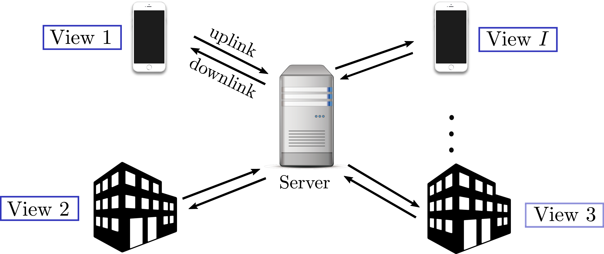
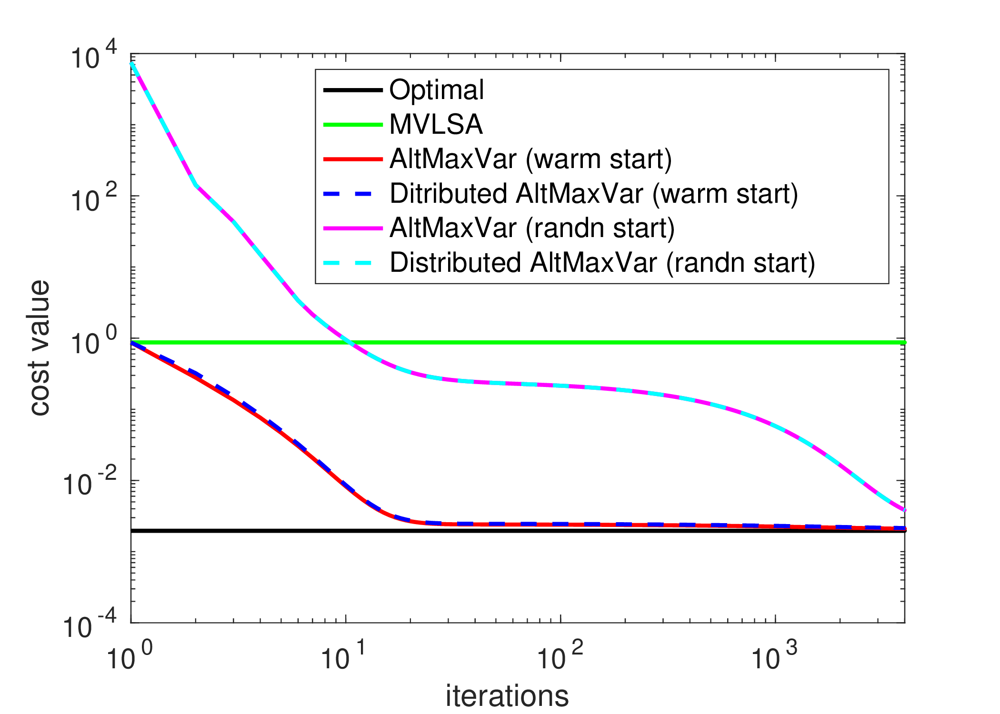
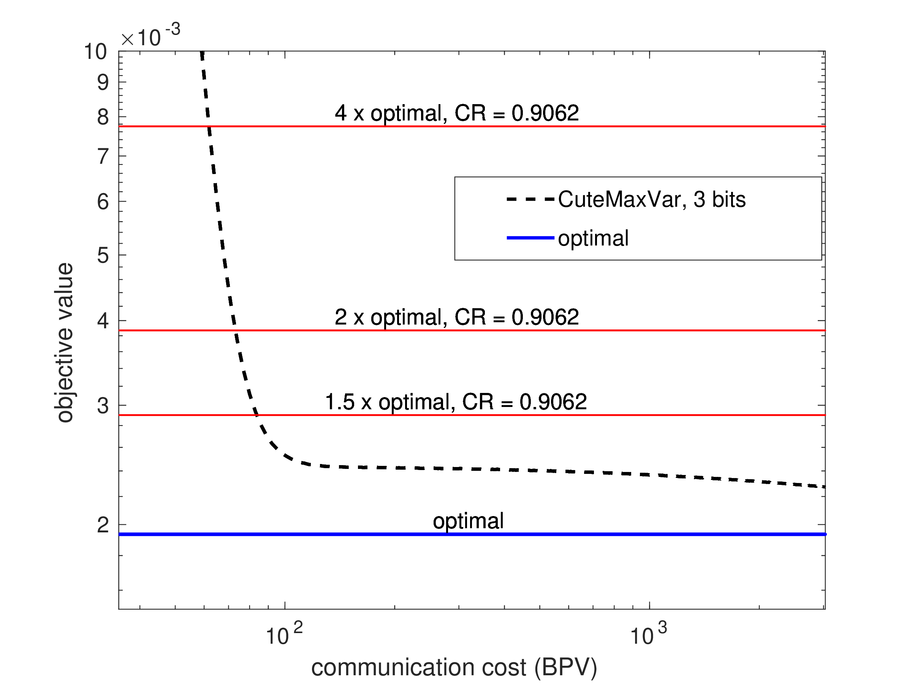
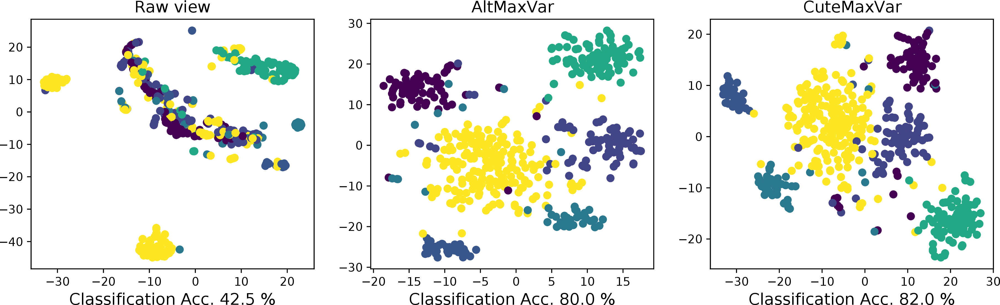
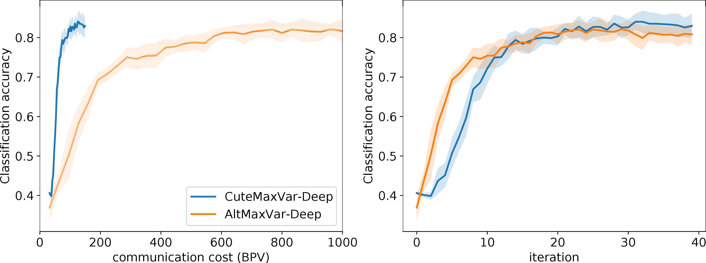

# Communication-Efficient Federated Linear and Deep Generalized Canonical Correlation Analysis (GCCA)

Implementation of the paper "[Communication-Efficient Federated Linear and Deep Generalized Canonical Correlation Analysis](https://ieeexplore.ieee.org/document/10099447)" published in IEEE Transactions on Signal Processing. A shorter conference version of the paper was published in ICASSP 2022, found [here](https://ieeexplore.ieee.org/document/9746607).

## Federated GCCA setting 

## Results

<figcaption>Synthetic data experiment</figcaption>

<!-- create a small vertical space -->

<!-- center align the subfigures -->

<!-- center align the figure caption -->
<figcaption>Real data experiment in EHR data</figcaption>

## Setup

## Executing the Code

